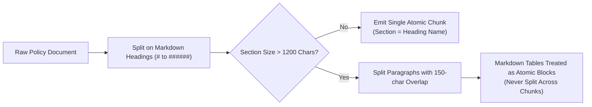
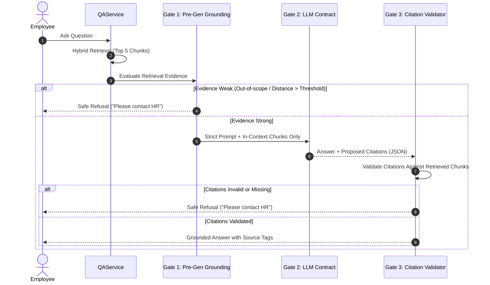

# 📐 System Design — HR Policy Assistant

> **A Production-Grade, Citation-Grounded Retrieval-Augmented Generation (RAG) Architecture for Company Policies.**

---

## 1. Executive Summary & Core Objectives

Enterprise policy inquiry systems operate in a zero-tolerance environment for hallucinations. If an AI gives an employee inaccurate information regarding medical coverage, leave carry-forwards, or confidential data handling, the repercussions can lead to compliance violations, legal disputes, and financial loss.

The **HR Policy Assistant** is architected around three non-negotiable principles:
1. **100% Policy Grounding:** Answers are synthesized exclusively from official company documents.
2. **Deterministic Source Attribution:** Every factual assertion must link to a verified document and section heading.
3. **Fail-Safe Refusal:** When policies do not contain unambiguous answers, the system must immediately and safely refuse without making assumptions.

---

## 2. High-Level Architecture

The system decouples **Ingestion** (write path) from **Query Processing** (read path) while sharing a local vector database ([ChromaDB](https://www.trychroma.com/)).

```mermaid
flowchart TD
    subgraph INGESTION["1. Ingestion Pipeline (Write Path)"]
        A["Admin Upload (.md / .txt)"] --> B["Document Loader\n(UTF-8 & Format Validation)"]
        B --> C["Section & Table-Aware Chunker\n(Markdown Heading Splitting)"]
        C --> D["Policy Indexer\n(Old Chunk Purge & Embeddings)"]
        D --> E[("ChromaDB\nPersistent Vector Store")]
    end

    subgraph QUERY["2. Query & Answer Pipeline (Read Path)"]
        U["Employee Question"] --> Q["QAService Orchestrator"]
        Q --> H["Hybrid Retriever"]
        H -->|Semantic Vector Search| E
        H -->|BM25 / Keyword Search| K["Token Overlap Scorer\n(Morphological Stemming)"]
        H -->|Reciprocal Rank Fusion (RRF)| R["Ranked Candidate Chunks"]
        
        R --> G{"Grounding Checker\n(Pre-Generation Gate)"}
        G -->|Weak Evidence / Out of Scope| REF["Safe Refusal Response\n('Please contact HR')"]
        G -->|Strong Evidence| GEN["Policy Generator\n(Google Gemini 3.6 Flash)"]
        
        GEN --> V{"Citation Validator\n(Post-Generation Gate)"}
        V -->|Hallucinated Citations| REF
        V -->|Verified Citations| RES["Grounded Answer + Citations\n(JSON / Web UI Display)"]
    end
```

### Component Responsibilities

| Component | Responsibility | Boundary & Invariant |
|---|---|---|
| `IngestionService` | Orchestrates upload, validation, chunking, and vector indexing. | The only service with write access to the filesystem and ChromaDB collection. |
| `QAService` | Orchestrates retrieval, grounding, generation, and citation validation. | Read-only orchestration layer; serves both FastAPI and Streamlit. |
| `HybridRetriever` | Blends dense vector search with sparse keyword search using Reciprocal Rank Fusion. | Normalizes vector distances and lexical frequencies onto a single scale. |
| `GroundingChecker` | Pre-generation gatekeeper that inspects retrieval evidence before calling the LLM. | Halts execution in `< 0.05s` if evidence is insufficient, saving API costs and eliminating hallucinations. |
| `PolicyGenerator` | Generates structured JSON answers with exponential backoff and connection retry. | Strictly constrained by system prompts and JSON schema contracts. |
| `CitationValidator` | Post-generation gatekeeper that cross-checks LLM citations against actually retrieved chunks. | Strips invalid citations; forces safe refusal if no valid sources remain. |

---

## 3. Document Ingestion & Chunking Strategy

### The Problem with Fixed-Size Window Chunking
Standard RAG tutorials split text into fixed token windows (e.g., 500 tokens with 50-token overlap). For policy documents, this is fundamentally flawed:
1. **Section Disconnect:** Numbered clauses (e.g., `4.1 Casual leave carry-forward`) get sliced across arbitrary boundaries.
2. **Table Rupture:** Markdown tables (such as health insurance tiers or LTA allowances) are torn across chunks, disconnecting table headers from row values.
3. **Ambiguous Citations:** When an employee asks *"What does Section 4.1 say?"*, fixed chunks cannot reliably map back to a human-readable heading.

### Section-Aware, Table-Atomic Chunking
Our custom chunker ([chunker.py](file:///d:/Rag_chat_bot/hr-policy-assistant/app/ingestion/chunker.py)) implements two strict rules:



1. **Heading-Aligned Chunk Boundaries:** Every chunk is tagged with its parent Markdown heading (`section` metadata). The chunk boundary **is** the citation boundary.
2. **Atomic Table Preservation:** Markdown tables (`| Col 1 | Col 2 |`) are treated as indivisible units. Even if a table exceeds the 1,200-character target, it remains intact to preserve tabular context (e.g., ensuring "Standard tier" is never separated from "Dental implants: Not covered").

### Stored Chunk Metadata

```json
{
  "chunk_id": "it-security-policy.md_chunk_004",
  "document": "it-security-policy.md",
  "section": "4. Data classification",
  "text": "| Classification | Examples | Allowed storage | ... \nConfidential and Restricted files must not be sent to personal email."
}
```

---

## 4. Hybrid Retrieval Architecture

HR policies contain two distinct categories of user queries:
- **Conceptual queries:** *"What happens if I get sick during vacation?"* (requires semantic understanding).
- **Exact clause & acronym queries:** *"What does section 4.1 say about CL?"* or *"What is the SSO policy?"* (pure semantic search frequently fails on short numbers and acronyms).

To solve this, retrieval uses a **two-signal hybrid pipeline** combined via **Reciprocal Rank Fusion (RRF)**:

```mermaid
flowchart LR
    Q["User Query"] --> V["Dense Vector Search\n(ChromaDB kNN, all-MiniLM-L6-v2)"]
    Q --> K["Sparse Keyword Search\n(Morphological Tokenizer + Overlap)"]
    
    V -->|Vector Rank (weight=0.7)| RRF["Reciprocal Rank Fusion\nRRF(d) = Σ w / (k + rank)"]
    K -->|Keyword Rank (weight=0.3)| RRF
    
    RRF --> Boost{"Query mentions exact section number?"}
    Boost -->|Yes| Bonus["Add +0.02 Score Boost"]
    Boost -->|No| Candidates["Top-5 Ranked Chunks"]
    Bonus --> Candidates
```

### 1. Dense Semantic Vector Search
- Model: `sentence-transformers/all-MiniLM-L6-v2` (384 dimensions, cosine distance space).
- Operates 100% locally on CPU with zero per-query network latency or API expense.
- Over-fetches candidate pool: `max(top_k * 2, 10)` chunks to give fusion rich candidates.

### 2. Sparse Lexical Search with Morphological Normalization
- Tokenizer preserves dotted section numbers (e.g. `4.1` remains `4.1` rather than splitting into `4` and `1`).
- **Morphological Stemming:** Common English suffixes (`-s`, `-es`, `-ed`, `-ing`, `-ies`) are normalized (e.g., `install` matches `installed`, `extension` matches `extensions`) while preserving acronyms (`SSO`, `LTA`, `CL`).

### 3. Reciprocal Rank Fusion (RRF)
Raw vector distances and keyword match counts operate on incomparable scales. RRF resolves this by combining item **ranks** rather than raw scores:

$$\text{RRF Score}(d) = \frac{w_{\text{vector}}}{k + \text{rank}_{\text{vector}}(d)} + \frac{w_{\text{keyword}}}{k + \text{rank}_{\text{keyword}}(d)}$$

- Default parameters: $k = 60$, $w_{\text{vector}} = 0.7$, $w_{\text{keyword}} = 0.3$.
- **Section Number Boost:** A chunk receives a bonus score ($+0.02$) if the query explicitly mentions a section number that matches the chunk's heading prefix.

---

## 5. Anti-Hallucination Triad (Three Defense Gates)

To guarantee that no hallucinated answers reach employees, the system enforces **three independent defense gates**:



### Gate 1: Pre-Generation Grounding Gatekeeper (`GroundingChecker`)
Before invoking Gemini, retrieved candidates are audited against calibrated evidence criteria:

1. **Rule 1 (Exact Section Match):** Grounded if a chunk's section heading explicitly matches the query's requested section number.
2. **Rule 2 (Strong Semantic Similarity):** Grounded if top result vector distance satisfies:
   $$\text{distance} \le 0.35 \quad \text{and} \quad \text{RRF score} \ge 0.015$$
3. **Rule 3 (Semantic + Keyword Agreement):** Grounded if:
   $$\text{distance} \le 0.70 \quad \text{and} \quad \text{keyword overlap} \ge 0.50 \quad \text{and} \quad \text{RRF score} \ge 0.015$$
4. **Otherwise:** Immediate refusal. The LLM is never called, saving latency and quota.

### Gate 2: LLM System Contract (`PolicyGenerator`)
The prompt strictly enforces:
- *"Answer using ONLY the provided policy context."*
- *"Do not use outside knowledge or infer unstated policies."*
- Structured JSON output contract conforming to Pydantic schemas.

### Gate 3: Post-Generation Citation Validation (`CitationValidator`)
Even if the model generates a plausible answer with citations:
- Every returned `(document, section)` citation is checked against the set of chunks actually retrieved for that specific query.
- Any fabricated citation is dropped.
- If dropping leaves **zero valid citations**, the answer is rejected and replaced with the safe refusal message.

---

## 6. Schema Contracts & Data Models

A unified Pydantic model structure guarantees zero schema drift between FastAPI and Streamlit:

```python
class Citation(BaseModel):
    document: str
    section: str

class AskRequest(BaseModel):
    question: str = Field(min_length=1)

class AskResponse(BaseModel):
    answer: str
    citations: list[Citation]

class IngestResponse(BaseModel):
    document: str
    chunks_indexed: int
```

---

## 7. Operational Trade-Offs & Architecture Decisions

| Decision | Chosen Approach | Rejected Alternative | Engineering Justification |
|---|---|---|---|
| **Embeddings** | Local `sentence-transformers` (`all-MiniLM-L6-v2`) | Hosted Cloud Embedding API (e.g. OpenAI / Gemini) | **Privacy & Cost:** HR policies remain on-premises during embedding. Zero per-query API cost; works offline. |
| **Vector DB** | Embedded ChromaDB (`./chroma_db`) | Managed Vector DB (Pinecone / PgVector) | **Simplicity & Zero-Infra:** File-backed SQLite + DuckDB; requires no external services or network dependencies for local deployments. |
| **Ingestion** | Synchronous HTTP Upload | Asynchronous Celery / Redis Queue | **Scope Alignment:** A 50-page markdown policy chunks and indexes in `< 0.8s`. An async worker adds operational complexity with no user-facing gain at demo scale. |
| **Ranking** | Reciprocal Rank Fusion (RRF) | Linear Weighted Score Blending | **Scale Independence:** Vector distances (`[0, 2]`) and keyword fractions (`[0, 1]`) cannot be linearly summed without continuous calibration. RRF uses ordinal ranks. |
| **LLM Tier** | Google Gemini 3.6 Flash | Local Open-Source LLM (e.g. Llama-3 8B) | **Resource Footprint:** Allows running on consumer laptops with modest CPU/RAM while maintaining low latency and high JSON adherence. |

---

## 8. Failure Modes & Resilience Engineering

| Failure Scenario | Detection Mechanism | Mitigation Strategy |
|---|---|---|
| **Temporary API Rate Limit (429 / 503)** | HTTP Status Code in `PolicyGenerator` | Exponential backoff retry with jitter (`2s → 4s → 8s`). |
| **Network Socket Disconnect / Timeout** | Socket exception inspection | Classified as retryable error; connection re-established automatically. |
| **Empty or Whitespace Query** | Input validation check (`min_length=1`) | Caught at API boundary with HTTP 422; Streamlit presents friendly input warning. |
| **Empty or Malformed Upload** | Byte inspection in `IngestionService` | Rejected with descriptive error before touching filesystem or ChromaDB. |
| **Out-of-Scope Query (Maternity, Pets, etc.)** | Grounding distance & keyword threshold check | Immediate refusal (`< 0.05s`) before invoking LLM. |

---

## 9. Evaluation Methodology & Benchmark Results

The system is evaluated continuously using [test_evaluation.py](file:///d:/Rag_chat_bot/hr-policy-assistant/tests/test_evaluation.py) across 8 reference scenarios:

```text
================================================================================
RAG EVALUATION SUITE
================================================================================
[PASS] How many casual leave days can I carry forward?       -> 100% Retrieval
[PASS] Can sick leave be carried to the next year?           -> 100% Retrieval
[PASS] How many privilege leave days can I carry forward?    -> 100% Retrieval
[PASS] When does carried-forward casual leave expire?        -> 100% Retrieval
[PASS] What does section 4.1 say about CL?                   -> 100% Retrieval
[PASS] Can I expense a personal home gym?                    -> 100% Retrieval
[PASS] Does the company provide free gym membership?         -> 100% Correct Refusal
[PASS] What is the company's maternity leave policy?         -> 100% Correct Refusal
================================================================================
SUMMARY: 8/8 Tests Passed (100.0% Retrieval Accuracy | 100.0% Safe Refusal Rate)
================================================================================
```

---

## 10. Roadmap & Future Enhancements

1. **Document Format Diversification:** Add PDF and DOCX parsers with vision-language table extractors for multi-page complex corporate forms.
2. **Entailment Checking (NLI):** Implement Natural Language Inference to verify that every generated sentence is semantically entailed by the cited chunk, not just co-present in the source.
3. **Role-Based Access Control (RBAC):** Restrict document ingestion (`POST /documents`) using JWT / OAuth2 claims (`admin` vs `employee`).
4. **Deep Health Check Endpoint:** Implement `/health/deep` that probes ChromaDB read/write capability, Gemini API latency, and embedding model availability.